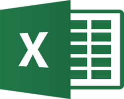
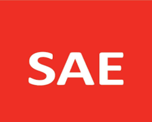
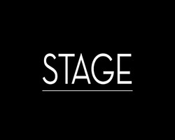
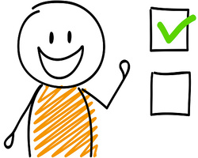
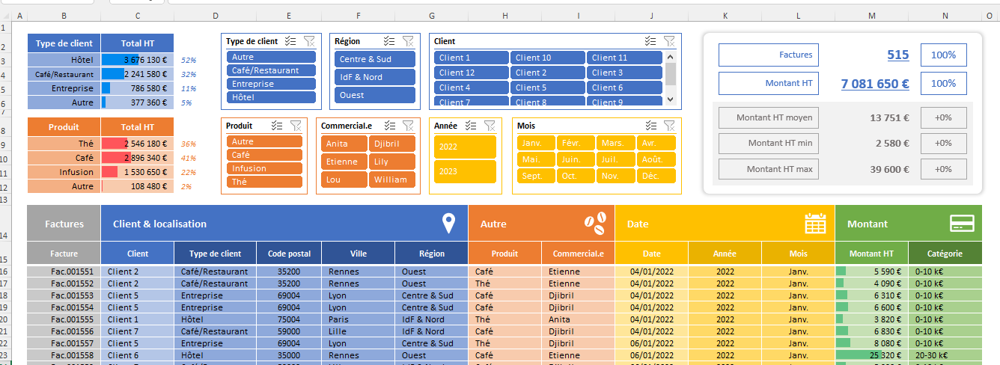
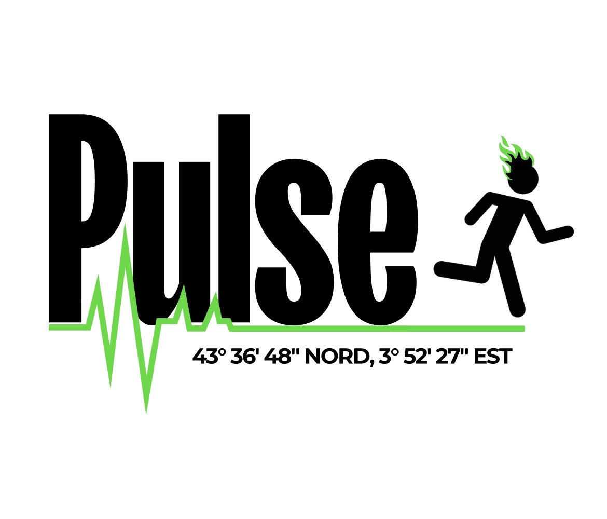
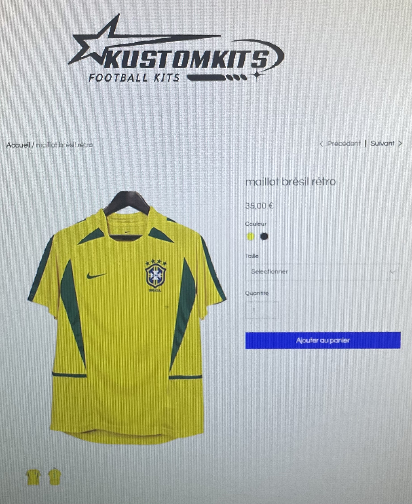
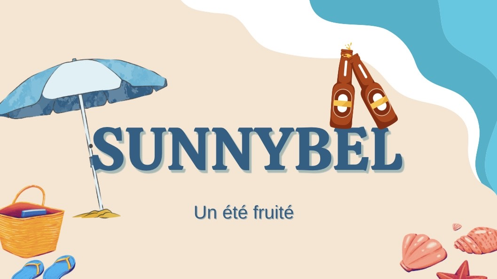
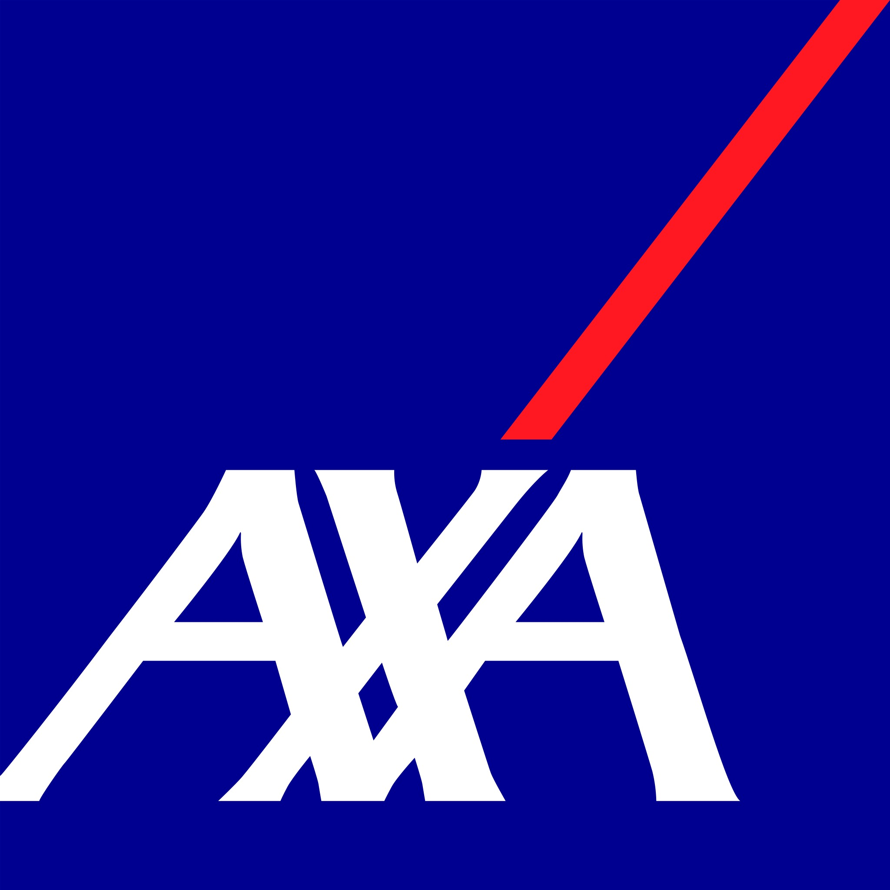
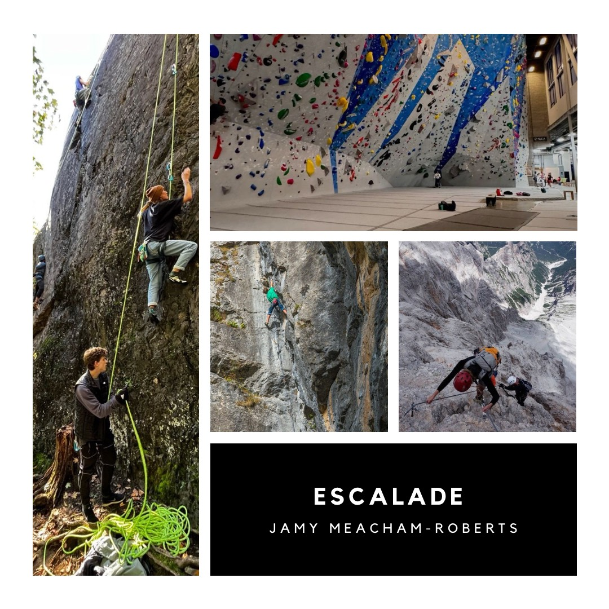

<!DOCTYPE html>
<html lang="en">

<head>

    <meta charset="utf-8">
    <meta http-equiv="X-UA-Compatible" content="IE=edge">
    <meta name="viewport" content="width=device-width, initial-scale=1">
    <meta name="description" content="">
    <meta name="author" content="">

    <title>Agency - Start Bootstrap Theme</title>

    <!-- Bootstrap Core CSS -->
    <link href="vendor/bootstrap/css/bootstrap.min.css" rel="stylesheet">

    <!-- Custom Fonts -->
    <link href="vendor/font-awesome/css/font-awesome.min.css" rel="stylesheet" type="text/css">
    <link href="https://fonts.googleapis.com/css?family=Montserrat:400,700" rel="stylesheet" type="text/css">
    <link href='https://fonts.googleapis.com/css?family=Kaushan+Script' rel='stylesheet' type='text/css'>
    <link href='https://fonts.googleapis.com/css?family=Droid+Serif:400,700,400italic,700italic' rel='stylesheet' type='text/css'>
    <link href='https://fonts.googleapis.com/css?family=Roboto+Slab:400,100,300,700' rel='stylesheet' type='text/css'>

    <!-- Theme CSS -->
    <link href="css/agency.min.css" rel="stylesheet">

    <!-- HTML5 Shim and Respond.js IE8 support of HTML5 elements and media queries -->
    <!-- WARNING: Respond.js doesn't work if you view the page via file:// -->
    <!--[if lt IE 9]>
        
        
    <![endif]-->

</head>

<body id="page-top" class="index">

    <!-- Navigation -->
    <nav id="mainNav" class="navbar navbar-default navbar-custom navbar-fixed-top">
        

            <!-- Brand and toggle get grouped for better mobile display -->
            

                <button type="button" class="navbar-toggle" data-toggle="collapse" data-target="#bs-example-navbar-collapse-1">
                    Toggle navigation Menu <i class="fa fa-bars"></i>
                </button>
                <a class="navbar-brand page-scroll" href="#page-top">Iut Montpellier</a>
            

            <!-- Collect the nav links, forms, and other content for toggling -->
            

                <ul class="nav navbar-nav navbar-right">
                    <li class="hidden">
                        
                    </li>
                    <li>
                        <a class="page-scroll" href="#services">Accueil</a>
                    </li>
                    <li>
                        <a class="page-scroll" href="#portfolio">Portfolio</a>
                    </li>
				
                    <li>
                        <a class="page-scroll" href="#about">Mes Compétences</a>
                    </li>
                    <li>
                        <a class="page-scroll" href="#team">Mes référents</a>
                    </li>
                    <li>
                        <a class="page-scroll" href="#contact">Contact</a>
                    </li>
					
                </ul>
            

            <!-- /.navbar-collapse -->
        

        <!-- /.container-fluid -->
    </nav>

    <!-- Header -->
    <header>
        

            

                
 

                

                <a href="#services" class="page-scroll btn btn-xl">Dites m'en plus</a>
            

        

    </header>

    <!-- Services Section -->
    <section id="services">
        

            

                

                    <h2 class="section-heading">Accueil</h2>
                    <h3 class="section-subheading text-muted">Apprenez en plus sur moi</h3>
                

            

            

                

                    
                        <i class="fa fa-circle fa-stack-2x text-primary"></i>
                        <i class="fa fa-shopping-cart fa-stack-1x fa-inverse"></i>
                    
                    <h4 class="service-heading">Moi</h4>
                    
Je me présente je suis Meacham-Roberts Jamy, j'ai 19 ans et j'habite actuellement à Montpellier. Je suis passioné de sport plus précisement le football et l'escalade. J'aime beacoup voyager et ait pu avoir la chance de visiter la Norvège, à Tahiti, les Etats-Unis, la Thailande...

                

                

                    
                        <i class="fa fa-circle fa-stack-2x text-primary"></i>
                        <i class="fa fa-laptop fa-stack-1x fa-inverse"></i>
                    
                    <h4 class="service-heading">Mes études </h4>
                    
J'étudie actuellement à l'Iut de Montpellier en Techniques de commercialisation spécialité commerce international. Grâce à mes études j'ai pu développer de nombreuses compétences liées au commerce comme la communication, le marketing, la vente... 

                

                

                    
                        <i class="fa fa-circle fa-stack-2x text-primary"></i>
                        <i class="fa fa-lock fa-stack-1x fa-inverse"></i>
                    
                    <h4 class="service-heading">Mon projet professionnel</h4>
                    
Plus tard j'aimerais travailler dans la communication dans le monde du sport,ce sont des domaines dans lequel je m'épanouis et aimerais les lier. Mon rêve serait d'avoir la chance de travailler avec la formule 1 ou la Premier league.

                

            

        

    </section>

    <!-- Portfolio Grid Section -->
    <section id="portfolio" class="bg-light-gray">
        

            

                

                    <h2 class="section-heading">Portfolio</h2>
                    <h3 class="section-subheading text-muted">Ici vous pouvez consulter mes projets.</h3>
                

            

            

                

                    <a href="#portfolioModal1" class="portfolio-link" data-toggle="modal">
                        

                            

                                <i class="fa fa-plus fa-3x"></i>
                            

                        

                        
                    </a>
                    

                        <h4>Excel</h4>
                        
Mes productions excel

                    

                

                

                    <a href="#portfolioModal2" class="portfolio-link" data-toggle="modal">
                        

                            

                                <i class="fa fa-plus fa-3x"></i>
                            

                        

                        
                    </a>
                    

                        <h4>Canva</h4>
                        
Mes productions canva

                    

                

                

                    <a href="#portfolioModal3" class="portfolio-link" data-toggle="modal">
                        

                            

                                <i class="fa fa-plus fa-3x"></i>
                            

                        

                        
                    </a>
                    

                        <h4>HTML</h4>
                        
Mes productions html

                    

                

                

                    <a href="#portfolioModal4" class="portfolio-link" data-toggle="modal">
                        

                            

                                <i class="fa fa-plus fa-3x"></i>
                            

                        

                        
                    </a>
                    

                        <h4>SAE</h4>
                        
Mes productions sae

                    

                

                

                    <a href="#portfolioModal5" class="portfolio-link" data-toggle="modal">
                        

                            

                                <i class="fa fa-plus fa-3x"></i>
                            

                        

                        
                    </a>
                    

                        <h4>Stage</h4>
                        
Mon stage

                    

                

                

                    <a href="#portfolioModal6" class="portfolio-link" data-toggle="modal">
                        

                            

                                <i class="fa fa-plus fa-3x"></i>
                            

                        

                        
                    </a>
                    

                        <h4>Perso</h4>
                        
Accomplissements perso

						
                    

                

            

        

		
		
        

            

                

                    <h2 class="section-heading">Video</h2>
		

                        <h4> Voici ma dernière création Multimédia :</h4>

  

        <video controls preload>
            <source src="video.mp4" type="video/mp4">
            
        </video>
 

</video>
    </section>

    <!-- About Section -->
    <section id="about">
        

            

                

                    <h2 class="section-heading">Mes Compétences</h2>
					
Retrouvez ici grâce à mon <a href="moncv.pdf">Curriculum Vitae</a> plus de détails sur mes formation pasées, mes expériences professionnelles et toutes mes compétences 

					
Vous pouvez aussi voir ma <a href="lettremotiv.pdf">lettre de motivation</a> ce qui vous permettera de voir ma motivation et mon investissement 

					
 Concernant mes expériences professionnelles j'ai pu réaliser un stage de 2 semaines dans une agence d'assurance ainsi qu'un autre stage de 2 semaines dans une entreprise d'import export de produits pour bateaux. En revanche je n'ai jamais travaillé pour le moment. 

					
                    <h3 class="section-subheading text-muted"></h3>
             
                        </li>
                    </ul>
                

            

        

    </section>

    <!-- Team Section -->
    <section id="team" class="bg-light-gray">
        

            

                

                    <h2 class="section-heading">Mes référents </h2>
                    <h3 class="section-subheading text-muted">Retrouvez mes référents de l'iut.</h3>
                

            

            

                

                    

                        
                        <h4>Christophe Chesa</h4>
                        
Professeur de spécialité international

                        <ul class="list-inline social-buttons">
                           <l><a href="#"><i class="fa fa-twtter"></i></a>
                            </li>
                            <l><a href="#"><i class="fa fa-faebook"></i></a>
                            </li>
                            <li><a href="https://www.linkedin.com/in/christophe-chesa-91aa5319a/"><i class="fa fa-linkedin"></i></a>
                            </li>
                        </ul>
                    

                

                

                    

                        
                        <h4>Bruno Rouchon</h4>
                        
Professeur d'informatique

                        <ul class="list-inline social-buttons">
                            <l><a href="#"><i class="fa fa-twtter"></i></a>
                            </li>
                            <l><a href="#"><i class="fa fa-faebook"></i></a>
                            </li>
                            <li><a href="https://www.linkedin.com/in/bruno-rouchon-21b18920/"><i class="fa fa-linkedin"></i></a>
                            </li>
                        </ul>
                    

                

                

                    

                        
                        <h4>Jacqueline Papet</h4>
                        
professeur de psychologie sociale

                        <ul class="list-inline social-buttons">
                            <l><a href="#"><i class="fa fa-witter"></i></a>
                            </li>
                            <l><a href="#"><i class="fa fa-acebook"></i></a>
                            </li>
                            <li><a href="https://www.linkedin.com/in/jacqueline-p-237338a8/"><i class="fa fa-linkedin"></i></a>
                            </li>
                        </ul>
                    

                

            

            

                

                    
J'ai eu la chance de profiter de ses professeurs qui pourront mieux vous indiquer comment je travaille que moi même.

                

            

        

    </section>

    <!-- Clients Aside -->
    <aside class="clients">
        

            

                

                    
                

                

                    
                

                

                    
                

                

                    
                

            

        

    </aside>

    <!-- Contact Section -->
    <section id="contact">
        

            

                

                    <h2 class="section-heading">Contactez moi</h2>
                    <h3 class="section-subheading text-muted">Trouvez les informations pour me contacter.</h3>
					<iframe src="https://www.google.com/maps/embed?pb=!1m18!1m12!1m3!1d2887.6167360543172!2d3.8480946763565402!3d43.63533537110293!2m3!1f0!2f0!3f0!3m2!1i1024!2i768!4f13.1!3m3!1m2!1s0x12b6aec3fc4072d7%3A0x1a1585a408bcfed4!2sIUT%20Montpellier!5e0!3m2!1sfr!2sfr!4v1732090375485!5m2!1sfr!2sfr" width="600" height="450" style="border:0;" allowfullscreen="" loading="lazy" referrerpolicy="no-referrer-when-downgrade"></iframe>
                

            

		
           
                            
                        

                    </form>
                

            

        

    </section>

    <footer>
        

            

                

                    
                

                

                    <ul class="list-inline social-buttons">
                        <li><a href="https://www.instagram.com/jamyrbrts/?next=%2F"><i class="fa fa-instagram"></i></a>
                        </li>
                        <li><a href="#"><i class="fa fa-facebok"></i></a>
                        </li>
                        <li><a href="https://www.linkedin.com/in/jamy-meacham-roberts-39885430b/"><i class="fa fa-linkedin"></i></a>
                        </li>
                    </ul>
                

                

                    <ul class="list-inline quicklinks">
                        <li>
                        <h3 class="section-subheading text-muted">robertsjamy@gmail.com.</h3>
						 <h3 class="section-subheading text-muted">06 25 15 08 08</h3>
                        <li>
                        </li>
                    </ul>
                

            

        

    </footer>

    <!-- Portfolio Modals -->
    <!-- Use the modals below to showcase details about your portfolio projects! -->

    <!-- Portfolio Modal 1 -->
    

        

            

                

                    

                        

                        

                    

                

                

                    

                        

                            

                                <!-- Project Details Go Here -->
                                <h2>Tableau excel</h2>
                                
Voici un tableau que j'ai produit.

                                
                                
Ceci est un exemple d'excel que j'ai réalisé, en effet je sais gérer cet outil afin d'effectuer toute sorte de calculs mais je sais aussi les rendre plus visuellement plaisable.

                                

                                    <strong></strong> <a href="https://getdpd.com/cart/hoplink/18076?referrer=bvbo4kax5k8ogc"> .

                                <ul class="list-inline">
                                    <li></li>
                                    <li></li>
                                    <li></li>
                                </ul>
                                <button type="button" class="btn btn-primary" data-dismiss="modal"><i class="fa fa-times"></i> Fermer le projet</button>
                            

                        

                    

                

            

        

    

    <!-- Portfolio Modal 2 -->
    

        

            

                

                    

                        

                        

                    

                

                

                    

                        

                            

                                <h2>Logo</h2>
                                
Logo que j'ai réalisé.
 
                                 Ceci est un logo effectué par mes soins pour mon projet tutoré. Il a été organisé par un organisme qui propose des soirées urbaines. Leur direction artistique était le vert et les stickman dans le style des panneaux de signalisation.
                                
<a href="http://designmodo.com/startup/?u=787"</a> 

                                
 .

                                <button type="button" class="btn btn-primary" data-dismiss="modal"><i class="fa fa-times"></i> Fermer le projet </button>
                            

                        

                    

                

            

        

    

    <!-- Portfolio Modal 3 -->
    

        

            

                

                    

                        

                        

                    

                

                

                    

                        

                            

                                <!-- Project Details Go Here -->
                                <h2>Site internet</h2>
                                
Mon site internet.

                                
                                
Ceci est un site que j'ai réalisé dans le cadre de mes études. Nous y avons mis beacoup de temps et avons organisé une boutique de maillots de foot. Vous pouvez le consulter <a href="https://nathancadoche.wixsite.com/kustomkits">ici</a>. 

                                
 .

                                <button type="button" class="btn btn-primary" data-dismiss="modal"><i class="fa fa-times"></i> Fermer le projet</button>
                            

                        

                    

                

            

        

    

    <!-- Portfolio Modal 4 -->
    

        

            

                

                    

                        

                        

                    

                

                

                    

                        

                            

                                <!-- Project Details Go Here -->
                                <h2>SAE</h2>
                                
Une de mes SAE.

                                
                                
Nous avons réalisé toute une identité de marque et des visuels pour une marque de bière, vous pouvez retrouver la présentation <a href="https://www.canva.com/design/DAF7MdMOlS4/rK1rAkZx88Q4GCH0DbKOgQ/view?utm_content=DAF7MdMOlS4&utm_campaign=designshare&utm_medium=link&utm_source=editor">ici</a>.

                                
 .

                                <button type="button" class="btn btn-primary" data-dismiss="modal"><i class="fa fa-times"></i> Fermer le projet </button>
                            

                        

                    

                

            

        

    

    <!-- Portfolio Modal 5 -->
    

        

            

                

                    

                        

                        

                    

                

                

                    

                        

                            

                                <!-- Project Details Go Here -->
                                <h2>Stage</h2>
                                
Mon stage.

                                
                                
Retrouvez mon rapport de stage  <a href="rapport.pdf">ici</a>. 

                                
</a>.

                                <button type="button" class="btn btn-primary" data-dismiss="modal"><i class="fa fa-times"></i> Close Project</button>
                            

                        

                    

                

            

        

    

    <!-- Portfolio Modal 6 -->
    

        

            

                

                    

                        

                        

                    

                

                

                    

                        

                            

                                <!-- Project Details Go Here -->
                                <h2>Accomplissements</h2>
                                
Mes accomplissements sportifs.

                                
                                
 L'escalade est un sport qui me passionne depuis tout petit, j'ai pu réaliser plusieures grandes compétitions dont j'ai pu repartir vainqueur pour quelques unes.

                                
</a>.

                                <button type="button" class="btn btn-primary" data-dismiss="modal"><i class="fa fa-times"></i> Fermer le projet</button>
                            

                        

                    

                

            

        

    

    <!-- jQuery -->
    

    <!-- Bootstrap Core JavaScript -->
    

    <!-- Plugin JavaScript -->
    

    <!-- Contact Form JavaScript -->
    
    

    <!-- Theme JavaScript -->
    

</body>

</html>
